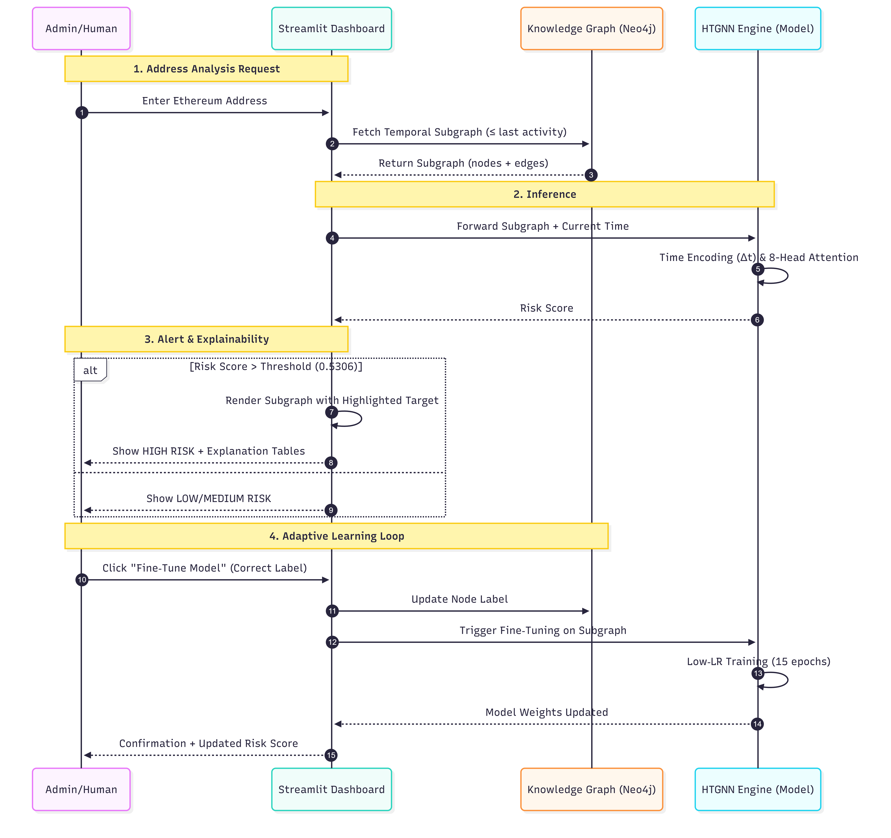

# Adaptive Fraud Detection in DeFi Using Heterogeneous Temporal Graph Neural Networks (HTGNNs)

[](https://www.python.org/downloads/release/python-310/)
[](https://www.dgl.ai/)
[](https://pytorch.org/)
[](https://neo4j.com/)
[](https://streamlit.io/)

A complete end‑to‑end system for detecting fraudulent accounts in Ethereum DeFi using a **Heterogeneous Temporal Graph Neural Network**. The model captures both the heterogeneous structure (wallets, contracts, tokens) and the temporal dynamics of blockchain transactions. A self‑evolving knowledge graph (Neo4j) stores node properties and enables adaptive fine‑tuning based on user feedback, all presented through an interactive Streamlit dashboard.

---

## Table of Contents
- [Features](#features)
- [Architecture](#architecture)
- [Requirements](#requirements)
- [Installation](#installation)
- [Project Structure](#project-structure)
- [Data Preparation](#data-preparation)
- [Model Training](#model-training)
- [Baselines & Ablations](#baselines--ablations)
- [Streamlit Dashboard](#streamlit-dashboard)
- [Results](#results-summary)
- [License](#license)

---

## Features
- **Heterogeneous Temporal GNN** – Models wallets, contracts, and tokens with timestamped edges.
- **Temporal Edge Masking** – Only transactions before the node’s last activity are considered during inference.
- **Adaptive Engine** – Fine‑tunes the model on a single confirmed fraud example (low learning rate, 15 epochs) without catastrophic forgetting.
- **Neo4j Knowledge Graph** – Stores all node properties and fraud labels; supports temporal subgraph queries via APOC.
- **Streamlit Dashboard** – Interactive address analysis, risk scoring, 1‑hop subgraph visualisation, and fine‑tuning.
- **Extensive Baselines** – Logistic Regression, XGBoost, GCN, GAT, RGCN, and ablation studies (8‑feature HTGNN, no‑temporal HTGNN).
- **Reproducible Results** – All metrics (AUPRC, confusion matrices, ROC, PR curves) saved to `results/`.

---

## System Architecture

*The interaction between the Streamlit UI, Neo4j Knowledge Graph, and the HTGNN inference engine.*

---

## Requirements
- **Python 3.10** (3.11+ may work but untested)
- **Neo4j** 5.x with [APOC plugin](https://neo4j.com/labs/apoc/) installed
- **Git** (for cloning)

---

## Installation

1. **Clone the repository**
   ```bash
   git clone https://github.com/prashanth1276/Adaptive-Fraud-Detection-in-DeFi-Using-HTGNNs.git
   cd Adaptive-Fraud-Detection-in-DeFi-Using-HTGNNs
   ```

2. **Create and activate a virtual environment**
    ```bash
    python -m venv venv
    source venv/bin/activate      # Linux / Mac
    venv\Scripts\activate         # Windows
    ```

3. **Install dependencies**
    ```bash
    pip install -r requirements.txt
    ```

4. **Set up Neo4j**
    - Install Neo4j Desktop and create a Local DBMS.
    - Set a password and start the database.
    - Install the APOC plugin (required for subgraph queries).
    - Copy `graph_nodes_labeled.csv` and `graph_edges.csv` into the database's `import` folder.
    - Open Neo4j, connect, and run all Cypher commands from `data_prep/Neo4j Codes.txt` in order.
    - Update your `.env` file with the correct URI, username, and password.

5. **Configure environment variables**
    Create a .env file in the project root (or copy .env.example)

    ```bash
    NEO4J_URI = bolt://localhost:7687
    NEO4J_USER = YOUR_USERNAME
    NEO4J_PASSWORD = YOUR_PASSWORD
    ```

---

## Project Structure
```
.
├── ablation/              # Ablation study scripts
├── baselines/             # Baseline model scripts
├── data_prep/             # Data preprocessing scripts
├── DataSet/               # All generated data files (CSVs, graph.bin, scaler.pkl)
├── model/                 # HTGNN, adaptive engine, database connector
├── results/               # All outputs: plots, checkpoints, configs
├── train/                 # Training script
├── utils/                 # Metrics and plotting utilities
├── app.py                 # Streamlit dashboard
├── best_model.pth         # (symlink/copy) – used by app
├── .env                   # Actual Environment Variables
├── .gitignore             # Files, Folders to Ignore
├── .env.example           # Example environment variables
├── requirements.txt       # dependencies
└── README.md              # This file
```
---

## Data Preparation
```bash
# 1. Clean and preprocess the raw data
python data_prep/data_preprocessing.py

# 2. Build node and edge lists (includes 12 engineered node features)
python data_prep/nodes_edges_generation.py

# 3. (Optional) Add fraud labels – you need a script that merges the flag column
#    (if not already present). Example: add_fraudlabels_nodes.py
python data_prep/add_fraudlabels_nodes.py

# 4. Construct the DGL heterogeneous graph
python data_prep/dgl_graph_construction.py
```

After these steps, the DataSet/ folder will contain:
- graph.bin – the DGL graph
- node_id_map.pkl – mapping from addresses to node indices
- scaler.pkl – fitted StandardScaler (will be created during training)
- nodes_audit.csv – node metadata for debugging

### Neo4j Loading
Copy graph_nodes_labeled.csv and graph_edges.csv into Neo4j’s import folder and execute the commands in data_prep/Neo4j Codes.txt. This creates :Wallet, :Contract, and :Token nodes with all 12 properties, and :TRANSACTED relationships with timestamps.

---

## Model Training
Train the full 12‑feature HTGNN model (temporal split, Focal Loss, 100 epochs):

```bash
    python -m train.train
```
The script automatically:
- Splits data by time (85% train/val, 15% test)
- Scales features using StandardScaler
- Tracks validation AUPRC and saves the best model to results/best_model.pth
- Plots confusion matrix, ROC and PR curves in results/
- Prints final test AUPRC

### Hyperparameters
| Parameter          | Value        |
|--------------------|--------------|
| Optimizer          | Adam         |
| Learning Rate (main) | 0.0005     |
| Learning Rate (adaptive) | 5e-6    |
| Loss Function      | Focal Loss (`γ=1.5`, `α=0.95`) |
| Hidden Dimensions  | 128          |
| Time Encoding Dim  | 32           |
| Number of Epochs   | 100          |
| Early Stopping Patience | 15       |

---

## Baselines & Ablations
All baseline scripts are located in baselines/ and ablation/. Run them from the project root:
| Model | Command |
|-------|---------|
| Logistic Regression | `python -m baselines.logistic_regression` |
| XGBoost | `python -m baselines.xgboost` |
| GCN (homogeneous) | `python -m baselines.gcn_homogeneous` |
| GAT (homogeneous) | `python -m baselines.gat_homogeneous` |
| RGCN | `python -m baselines.rgcn` |
| HTGNN (8 features) | `python -m ablation.features_8` |
| HTGNN (no temporal) | `python -m ablation.no_temporal` |

---

## Streamlit Dashboard
Launch the interactive dashboard:
```bash
    streamlit run app.py
```

Features:
- Enter any Ethereum address that exists in the graph.
- View the model’s risk score and a risk level (High/Medium/Low) based on the optimal threshold.
- See node metadata (internal ID, last activity time).
- Visualise the 1‑hop neighbourhood (static plot) and expand to see detailed node/edge tables.
- If you disagree with the prediction, use the Adaptive Engine to correct the label. The model fine‑tunes on the 2‑hop subgraph (15 epochs, low LR) and updates the knowledge graph.

---

## Results Summary

| Model | Validation AUPRC | Test AUPRC |
|-------|------------------|------------|
| Logistic Regression | 0.0194 | 0.0011 |
| GCN | 0.1480 | 0.0031 |
| XGBoost | 0.4425 | 0.0103 |
| GAT | 0.3320 | 0.0076 |
| RGCN | 0.3631 | 0.0212 |
| HTGNN (no temporal) | 0.1736 | 0.0190 |
| HTGNN (8 features) | 0.1283 | 0.0115 |
| **HTGNN (12 features)** | **0.1950** | **0.0209** |

The full HTGNN achieves the **highest test AUPRC** (0.0209) among all models except RGCN (0.0212). However, RGCN's test performance is inconsistent across runs, and its validation AUPRC (0.3631) is much higher than test, indicating overfitting. HTGNN maintains the best balance between validation and test, proving the value of temporal encoding, heterogeneity, and the engineered node features.

**Observation:**  
XGBoost achieves a high validation AUPRC (0.4425) but collapses on the test set (0.0103), indicating severe overfitting to temporal patterns. In contrast, HTGNN generalizes more robustly.

---

## License
This project is licensed under the MIT License – see the LICENSE file for details.

---

## Contact
For questions or collaborations, please contact:
- Prajwal M K – [prajwalmkmys@gmail.com]
- Prashanth S – [prashanths272005@gmail.com]
- Pratap Raj P – [prathaprajdpk3568@gmail.com]
- Rashmi S - [s.rashmi@vvce.ac.in]

Under the guidance of Prof. Rashmi S, Department of ISE, VVCE.